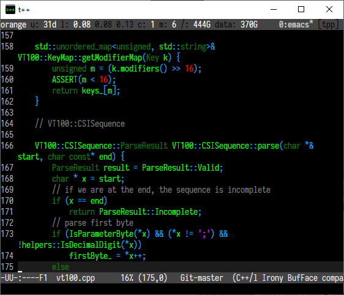
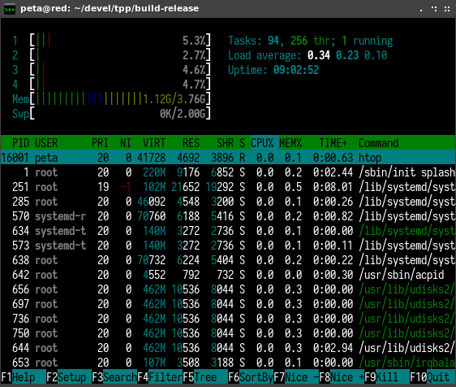
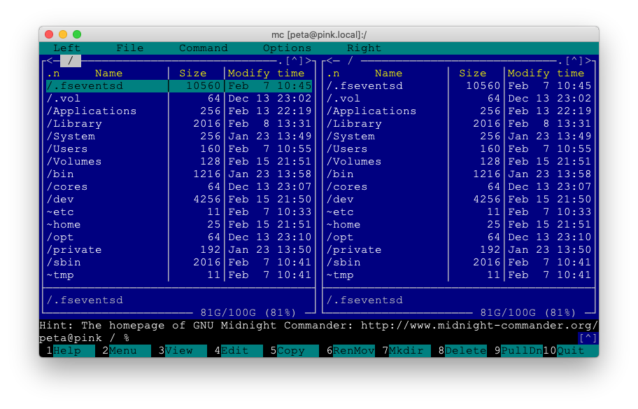

<h1 class="display-3"> Terminal++</h1>

    <code>terminalpp</code> is a minimalist but powerful terminal emulator which provides almost identical features and user experience on all major operating systems - Windows, Linux and macOS. 

    <!-- Windows downloads -->
    

      <button role="button" class="btn btn-dark btn-lg" onclick="window.location='https://github.com/terminalpp/terminalpp/releases/latest/download/terminalpp.msi'">
          <i class="fab fa-windows"></i> Windows
      </button>
    

    <!-- Linux downloads -->
    

      <button type="button" class="btn btn-dark btn-lg" onclick="window.location='https://snapcraft.io/terminalpp'">
          <i class="fab fa-linux"></i> Linux
      </button>
      <button type="button" class="btn btn-dark dropdown-toggle dropdown-toggle-split" data-toggle="dropdown" aria-haspopup="true" aria-expanded="false">
        Toggle Dropdown
      </button>
      

        <a class="dropdown-item" href="https://snapcraft.io/terminalpp">snap
            <i class="fab fa-linux"></i>
        </a>
        <a class="dropdown-item" href="https://github.com/terminalpp/terminalpp/releases/latest/download/terminalpp.deb">deb
            <i class="fab fa-ubuntu"></i>
        </a>
        <a class="dropdown-item" href="https://github.com/terminalpp/terminalpp/releases/latest/download/terminalpp.rpm">rpm
            <i class="fab fa-suse"></i>
            <i class="fab fa-redhat"></i>
            <i class="fab fa-fedora"></i>
        </a>
      

    

    <!-- macOS downloads -->
    

      <button type="button" class="btn btn-dark btn-lg" onclick="window.location='https://github.com/terminalpp/terminalpp/releases/latest/download/terminalpp-macos.zip'">
          <i class="fab fa-apple"></i> macOS
      </button>
    

  

    

      
    

    

      
    

    

      
    

  

  <a class="carousel-control-prev" href="#carouselExampleFade" role="button" data-slide="prev">
    
    Previous
  </a>
  <a class="carousel-control-next" href="#carouselExampleFade" role="button" data-slide="next">
    
    Next
  </a>

<!-- TODO generate this perhaps -->

<h1 class="display-4 text-center h-divider">Feature Highlights</h1>

  

    

      <!--  -->
      

        <h5 class="card-title">Cross-platform</h5>
        

            <code>terminalpp</code> natively supports Windows 10 and Linux and works on macOS via a Qt renderer.
        

      

    
  
  

  

    

      <!--  -->
      

        <h5 class="card-title"><a href="/features/pty-bypass.html">Fast</a></h5>
        

            On native platforms <code>terminalpp</code> is either on par, or faster than really fast emulators such as alacritty. Order(s) of magnitude faster on Windows with ConPTY bypass.
        

      

    
  
  

  

    

      <!--  -->
      

        <h5 class="card-title"><a href="/features/configuration.html">Fonts &amp; Colors</a></h5>
        

            Support for all possible colors (16M) and native font fallback for extra characters. CJK, double width and double size characters support..
        

      

    
  
  

  

    

      <!--  -->
      

        <h5 class="card-title"><a href="/features/clipboard.html">Clipboard</a></h5>
        

            Bi-directional clipboard. Primary and clipboard buffers on Linux, clipboard and emulated primary buffer in Windows. Paste preview is supported.
        

      

    
  
  

  

    

      <!--  -->
      

        <h5 class="card-title">Zoom</h5>
        

            <code>ctrl-</code> and <code>ctrl=</code> to fast zoom in & out similar to web browsers and other GUI apps.        
        

      

    
  
  

  

    

      <!--  -->
      

        <h5 class="card-title">History</h5>
        

            Remembers terminal output outside of the visible area when it matters.
        

      

    
  
  

  

    

      <!--  -->
      

        <h5 class="card-title"><a href="/features/remote-files.html">Remote Files</a></h5>
        

            Allows opening files from remote servers the terminal is connected to on local computer via the <code>ropen</code> command. Supports <code>tmux</code> passthrough.
        

      

    
  
  

